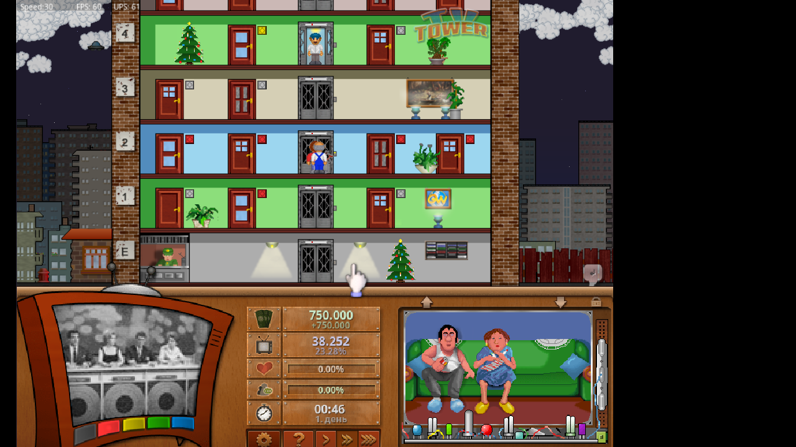

# TVTower (Русская локализация / Russian Localization)

Добро пожаловать в неофициальный форк игры TVTower (MadTV remake), ориентированный на русскоязычное сообщество.

> **ВНИМАНИЕ:** Этот перевод находится на стадии **Beta/WIP** (Work in Progress). Из-за технических особенностей движка игры и ограниченной поддержки кириллицы, **возможны вылеты** в определенных меню или при отображении некоторых строк. Пожалуйста, сохраняйтесь чаще!

---

## 📸 Скриншоты / Screenshots

| | |
| :---: | :---: |
|  |  |

---

## 🛠 Статус перевода и известные проблемы

Разработчики оригинальной игры знают о проблемах с кириллицей, но полноценного решения пока нет. Данная локализация — попытка сделать игру доступной на русском языке «как есть».

**Что сделано:**
- [x] Переведен основной интерфейс.
- [x] Локализована большая часть названий и описаний.
- [x] Исключены символы (например, 'Ё'), вызывающие немедленный краш.

**Известные проблемы:**
- ⚠️ Некоторые строки остались на английском из-за риска вылетов.
- ⚠️ Названия фильмов/шоу не удалось перевести из-за кириллицы.
---

## 📥 Установка и использование

Для обычных игроков:

1.  Нажмите кнопку зеленый кнопку **[<> Code]** вверху этой страницы и выберите **Download ZIP**.
2.  Распакуйте архив.
3.  Запустите TVTower_Win64.exe / TVTower_Win32.exe

---

## 🤝 Как помочь и обратная связь

Если вы хотите помочь с тестами или улучшением перевода:

1.  **Тестирование:** Если вы нашли конкретное слово или меню, которое вызывает вылет, пожалуйста, создайте **Issue** на этой странице (вкладка "Issues") с подробным описанием: что вы делали и какое слово было на экране.
2.  **Правки:** Вы можете сделать *Fork* моего репозитория, внести свои правки и отправить мне *Pull Request*.
3.  **Для разработчиков:** Если вы знаете, как пропатчить движок игры для корректной отрисовки кириллицы (UTF-8/Windows-1251 без BOM), мы будем очень благодарны!

---

## Авторы
- Автор перевода: [Slobodskoy15](https://github.com/Slobodskoy15)
- Оригинальный проект: [TVTower/TVTower](https://github.com/TVTower/TVTower)