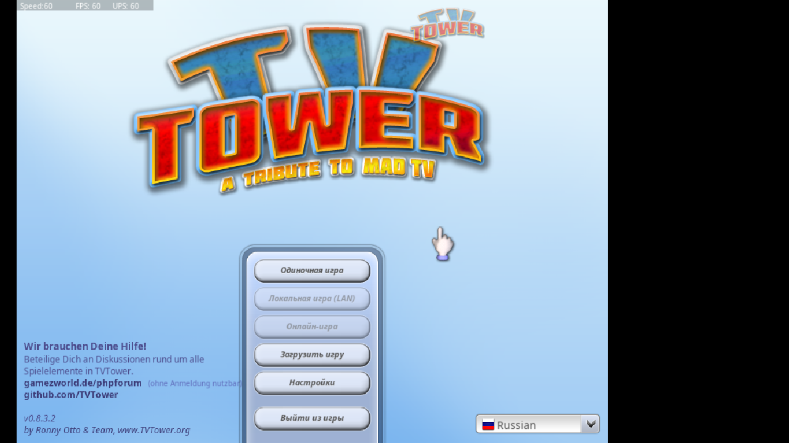
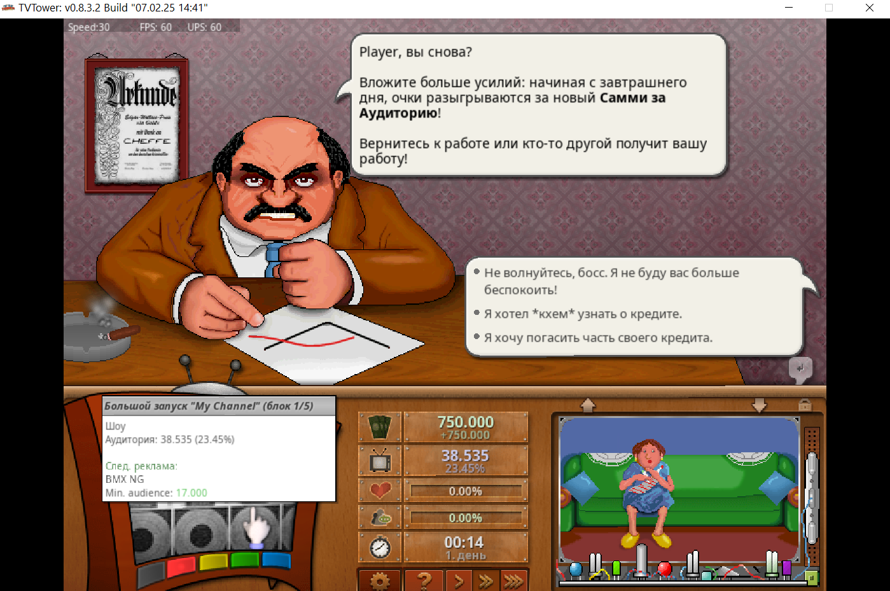
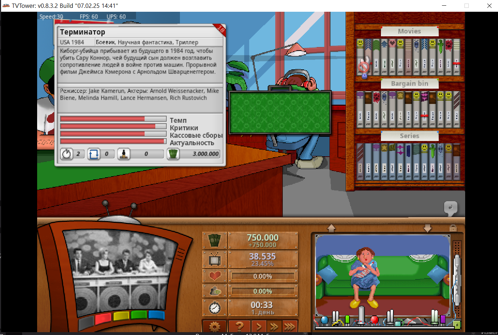
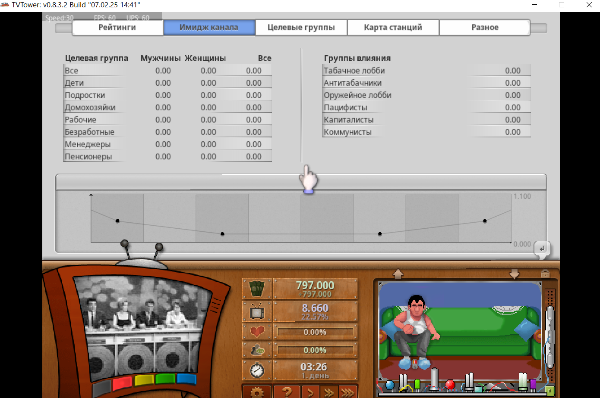
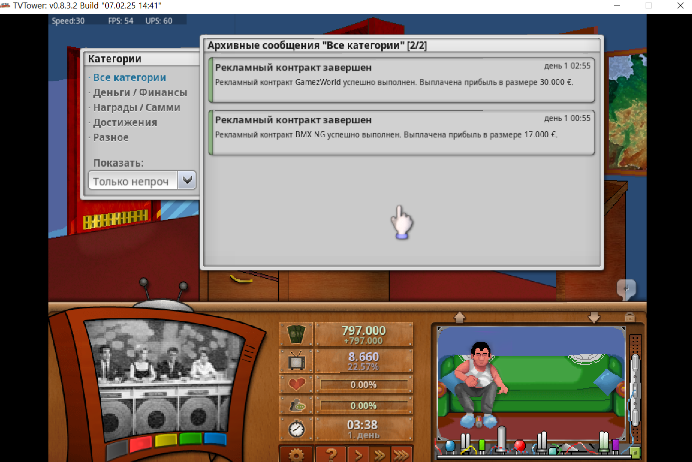

# TVTower Russian Localization (Русский перевод)

Форк от https://github.com/TVTower/TVTower

Добро пожаловать в репозиторий русской локализации для игры **TVTower** (духовного наследника Mad TV). Этот проект направлен на полный перевод интерфейса, новостей, рекламы и игровых механик на русский язык. 

## 📸 Скриншоты

Здесь можно увидеть текущий прогресс перевода интерфейса и игровых моментов:

| | |
| :---: | :---: |
|  |  |
|  |  |
|  | |

## 🛠 Установка

1. Скачайте файлы из этого репозитория (кнопка **Code** -> **Download ZIP**). 
2. Распакуйте содержимое в корневую папку с установленной игрой `TVTower`. 
3. Запустите игру через `TVTower_Win64.exe` (или Win32 версию). 
4. При первом запуске выбрать язык ОТЛИЧНЫЙ от русского, начать новую игру. Потом через меню вернуться обратно на титульный экран.
5. В главном меню перейдите в **Settings** и выберите язык **Russian**. 

## 📝 Что уже сделано

* Исправлены критические ошибки запуска (`ACCESS_VIOLATION`) при включении кириллицы. 
* Переведено главное меню и базовые настройки. 
* Частично переведены базы данных новостей и рекламных контрактов. 
* Начата работа над базами данных фильмов и телепередач. 

## ⚠️ Технические особенности

Игра разработана на движке **BlitzMax**, который крайне чувствителен к кодировкам.  Все файлы перевода сохранены в формате `UTF-8 без BOM` (или `Windows-1251`), чтобы избежать вылетов. 

---
*Разработано для фанатов Mad TV с любовью.*